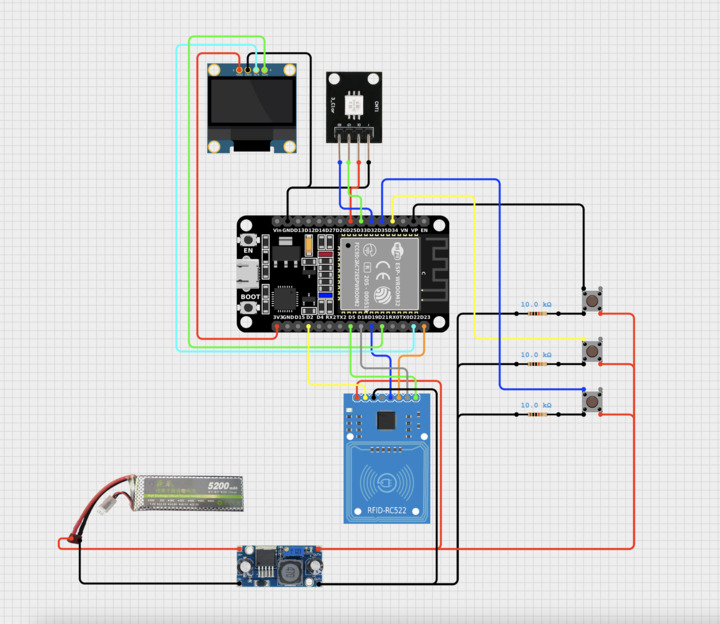

# Badge System

An ESP32-based RFID Badge Access Control System with visual feedback and administrative controls.



## Overview

The Badge System is an intelligent access control solution that uses RFID card readers to authenticate users. The system provides real-time feedback through an OLED display, RGB LED indicators, and supports administrative functions for badge management.

## Features

- **RFID Card Authentication**: Scan RFID badges to authenticate users
- **Visual Feedback**: RGB LED lights indicate access status
  - 🟢 Green: Access granted
  - 🔴 Red: Access denied
  - 🔵 Blue: System status
- **OLED Display**: Real-time status messages (128x64 pixels)
- **User Database**: Dynamic database for storing authorized card UIDs
- **Admin Mode**: Master card functionality for system administration
- **Button Controls**: Three configurable input buttons for various functions
- **SPI Communication**: Efficient hardware communication with RFID reader

## Hardware Components

### Microcontroller
- **ESP32** Development Board

### Storage & Communication
- **MFRC522** RFID Reader Module
  - SPI communication interface
  - 13.56 MHz frequency
  - ISO14443A compatible

### Display
- **Adafruit SSD1306** OLED Display
  - I2C communication
  - 128x64 pixel monochrome display

### Indicators & Controls
- **RGB LED** (Common Cathode)
  - Red LED pin
  - Green LED (PWM capable)
  - Blue LED (PWM capable)
- **3x Push Buttons**
  - Black button
  - Blue button
  - Yellow button

## Pin Configuration

### RFID Reader (SPI)
| Pin | ESP32 GPIO |
|-----|-----------|
| SS  | GPIO 5    |
| RST | GPIO 2    |
| SCK | GPIO 18   |
| MISO| GPIO 19   |
| MOSI| GPIO 23   |

### RGB LED (PWM)
| Color | GPIO |
|-------|------|
| Red   | GPIO 33 |
| Green | GPIO 25 |
| Blue  | GPIO 32 |

### Push Buttons (Input)
| Button | GPIO |
|--------|------|
| Black  | GPIO 36 |
| Blue   | GPIO 35 |
| Yellow | GPIO 34 |

### OLED Display (I2C)
| Pin | GPIO |
|-----|------|
| SDA | GPIO 21 |
| SCL | GPIO 22 |

## Project Structure

```
BadgeSystem/
├── BadgeSystem.ino       # Main sketch with setup and loop
├── BadgeSystem.hpp       # Header file with pin definitions and structs
├── DataBase.cpp          # Card database management
├── Display.cpp           # OLED display functions
└── ProjectDesign.jpg    # System architecture diagram
```

## Setup Instructions

1. **Install Arduino IDE** or PlatformIO
2. **Install Required Libraries**:
   - MFRC522 by GithubCommunity
   - Adafruit GFX Library
   - Adafruit SSD1306

3. **Hardware Setup**:
   - Connect all components according to the pin configuration above
   - Ensure proper power supply for ESP32 and RFID module

4. **Upload Firmware**:
   - Open BadgeSystem.ino in Arduino IDE
   - Select ESP32 board and appropriate COM port
   - Upload the sketch

## Operation

1. **RFID Scan**: Present an authorized badge to the RFID reader
2. **Visual Feedback**: 
   - Green light + "ACCESS GRANTED" message = Authorization successful
   - Admin mode message = Master card detected
3. **Button Controls**: Use the three buttons to navigate and manage the system

## Author & License

Created as an access control demonstration project.
